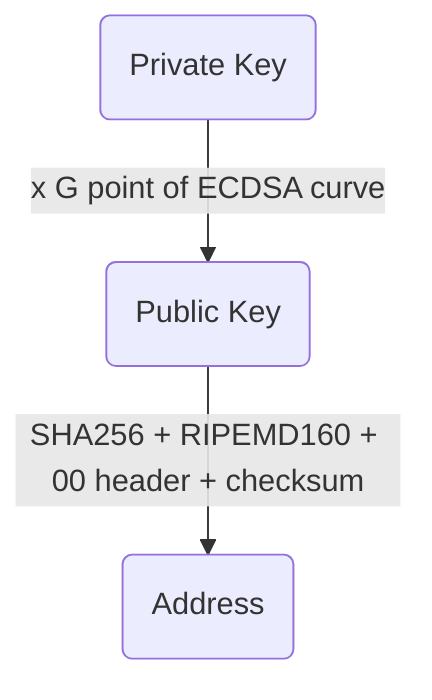

## Bitcoin keys and address generator && Transaction

Bitcoin keys and address generator is intended to provide python code corresponding to the following transformations:

Well note than two versions of keys can be used:
  * Uncompress keys : which means, for:
    * Private key : without 01 suffix
    * Public key : with both X and Y coordinates
    * Address:  computed from uncompressed public key
  * Compressed keys : which means, for:
    * Private key : with 01 suffix
    * Public key : wiithout Y coordinate, but with a bit to indicate on which of the two ECDSA curve branches the public point is
    * Address : computed from compressed public key  
